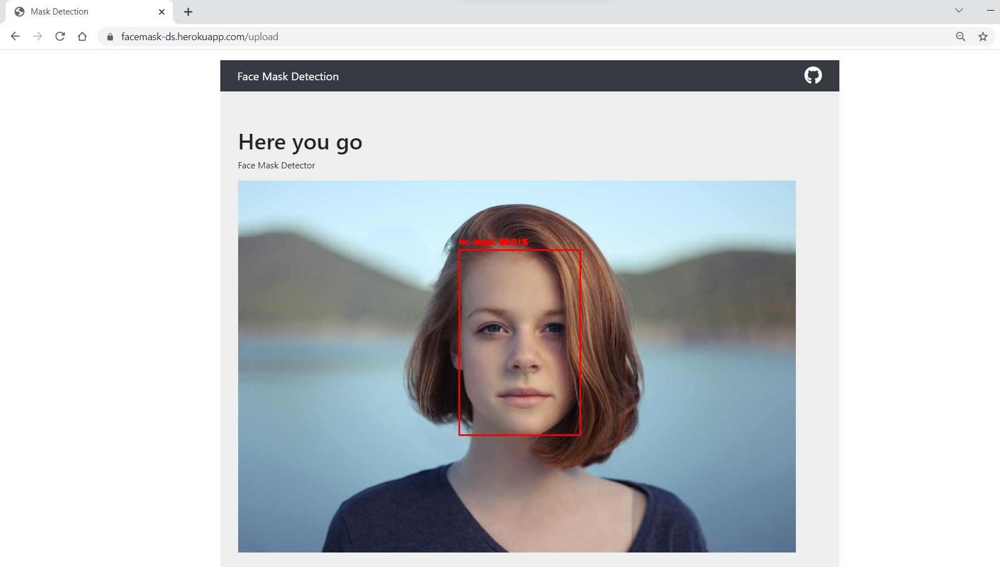
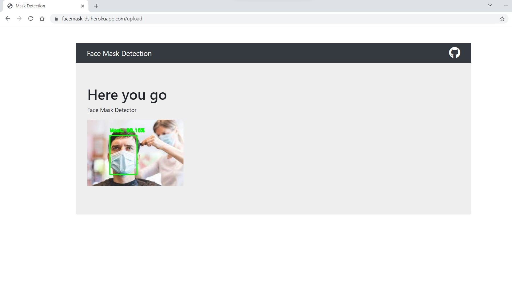
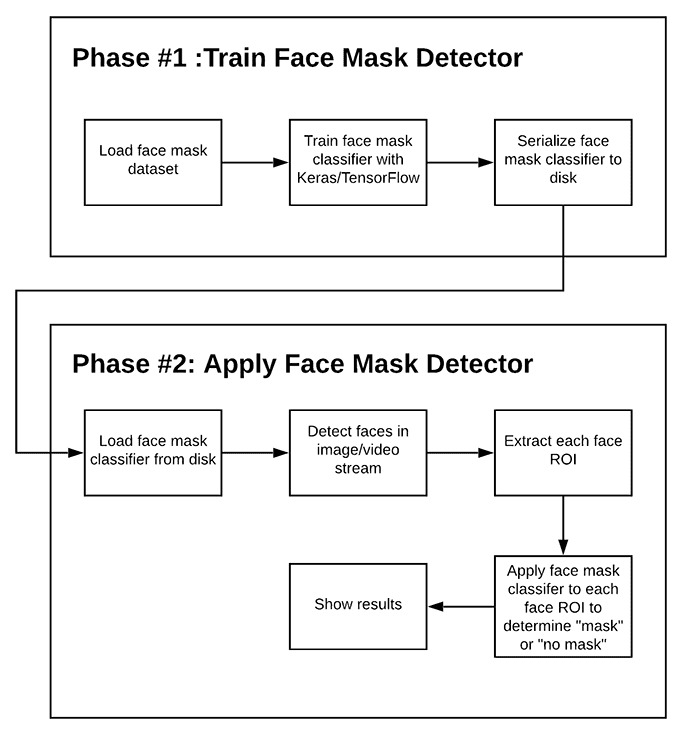

# UCS757:Building Innovative Systems
## Submitted by:-
### Garhvita Sethi
### 101803708
### COE 15

# Projects

# Project 2: Face Mask Detection
## Introduction
The web app takes an image of a person as input and returns whether the person is wearing a mask or not.

## Requirements
1. Python
2. Numpy
3. Tensorflow

## Live Link
https://facemask-ds.herokuapp.com/

## Input Interface

## Input - Without Mask

## Output - Without Mask

## Input - With Mask

## Output - With Mask

## Flowchart

## Novelty
1. Detecting face mask using an image, can also be extended to detect it in a video stream
2. Detecting if many people in a crowd are wearing masks or not
3. Confidence is calcuated( probability associated with the detection) and threshold can be customized to filter out weak detections
